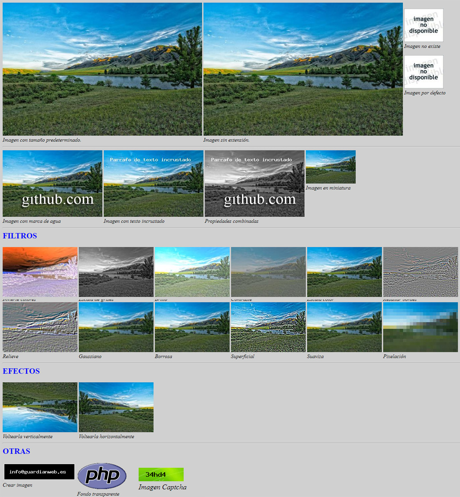

# imagen-php

Esta clase ha sido creada para ahorrarle tiempo en sus proyectos o sitios Web y poder hacer uso de un código optimizado para usar en sus imágenes, pudiendo realizar ajustes, aplicar filtros, efectos y otras, sin necesidad de escribir una sola linea de código. 

Únicamente necesitará el fichero <code>img.php</code> para usar en sus proyectos, sin enmarañar sus directorios con excesivos ficheros que nunca usará o serán innecesarios. Simple, fácil y compatible. Haciendo uso de la biblioteca GD integrada que viene con PHP.

<h3 align="center">Puede descargarlo gratis aquí: <a href="https://github.com/sergiogongil/imagen-php.git">GitHub - imagen-php</a></h3>

<h2>Notas sobre funciones y modificaciones</h2>
<ul>
  <li>Cargar imágenes sin formato en HTML</li>
  <li>Cargar imágenes de distintos formatos</li>
  <li>Mostrar miniaturas de las imágenes originales</li>
  <li>Definido tamaño máximo de imagen (por seguridad)</li>
  <li>Aplicar marca de agua a las imágenes</li>
  <li>Texto en imágenes incrustado</li>
  <li>Transforma tus imágenes a blanco y negro</li>
  <li>Auto ajuste de proporciones del tama&ntilde;o</li>
  <li>Aplicar filtros de imagen: Escala de grises, Gaussiano, contraste, brillo, negativo, etc.</li>
  <li>Aplicar efectos de imagen: Voltearla verticalmente y horizontalmente.</li>
  <li>Crear imagen a partir de un texto</li>
  <li>Generador de código Captcha para integrar en tu Web site</li>
</ul>

<h2>Ejemplos de uso</h2>

Podrás aplicar filtros y ajustes a tus imágenes, directamente indicándolo en la URL con el paso de variables GET.

<i>Para aplicar una marca de agua:</i>
<pre>&lt;img src="img.php?n=imagen.jpg&<b>m=1</b>"&gt;</pre>

<i>Integrar Captcha:</i>
<pre>&lt;img src="img.php?<b>n=captcha</b>"&gt;</pre>

<i>Para incrustar un texto a tu imagen:</i>
<pre>&lt;img src="img.php?n=imagen.jpg&<b>t=Hola Mundo!</b>"&gt;</pre>

<i>Aplicar filtros de imagen:</i>
<pre>&lt;img src="img.php?n=imagen.jpg&<b>f=1</b>"&gt;</pre>

<i>Aplicar efectos de imagen:</i>
<pre>&lt;img src="img.php?n=imagen.jpg&<b>e=1</b>"&gt;</pre>

<i>Crear imagen a partir de un texto</i>
<pre>&lt;img src="img.php?n=icrear&x=220&y=55&t=info@guardianweb.es"&gt;</pre>

<i>Con esta lógica y de esta forma tan simple, puedes transformar tus imágenes, aplicarles filtros y otras funciones.</i>

<i>Si necesita ayuda o tiene cualquier duda, puede consultar la documentación disponible en: </i><a href="https://github.com/sergiogongil/imagen-php/wiki">https://github.com/sergiogongil/imagen-php/wiki</a>

